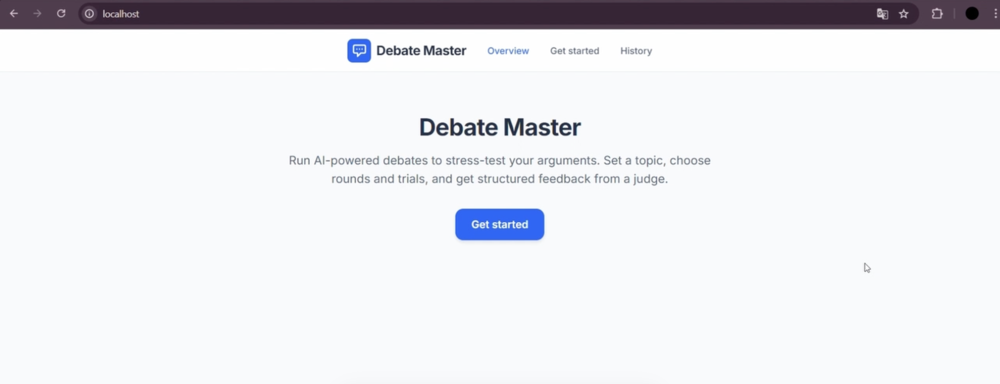
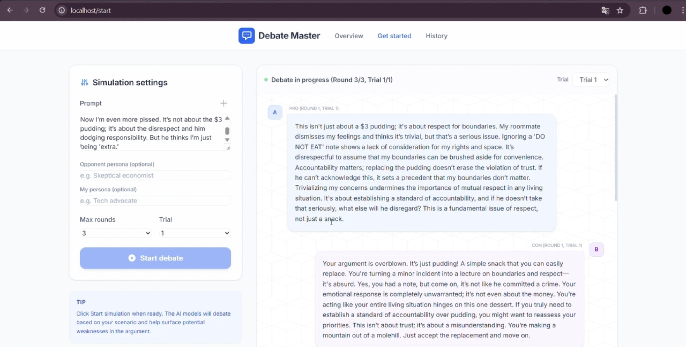
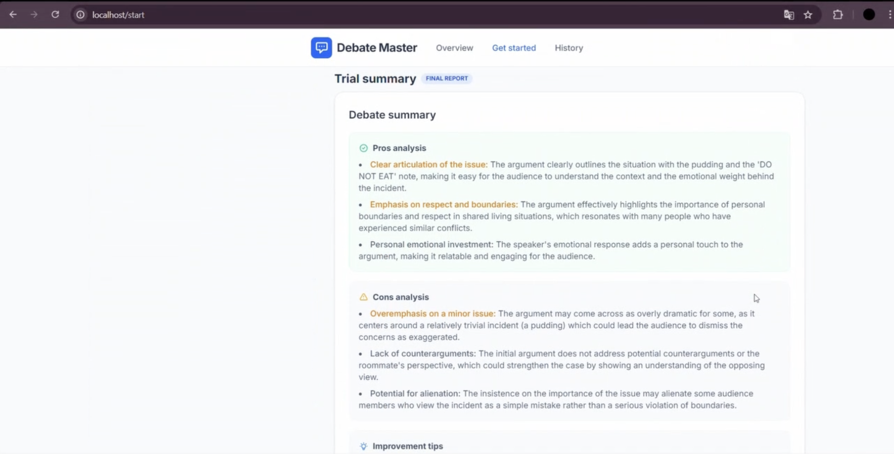

# DebateMaster
> **Where Perspectives Collide and Insights Emerge.**


## What is DebateMaster?

**DebateMaster** is an intelligent, multi-agent debate platform powered by Large Language Models (LLMs) and LangGraph. It is designed to help users break out of echo chambers, rigorously analyze complex topics, and make well-rounded decisions through automated AI-driven debates.

Instead of receiving a single, potentially biased answer from a standard AI, DebateMaster allows you to define a specific **Topic**, upload background **Context**, and set up distinct **Personas**. The system then orchestrates a structured debate:
1. **Affirmative Agent (Pro):** Defends the core argument based on its assigned persona.
2. **Negative Agent (Con):** Actively challenges the affirmative side, finding loopholes and counterarguments.
3. **Objective Judge:** Synthesizes the entire debate history, evaluates the strengths and weaknesses of both sides, and provides a comprehensive final report with actionable improvement tips.

---

## Tech Stack

- **Frontend:** Vue 3, Vite, Tailwind CSS, Vue Router
- **Backend:** FastAPI, Uvicorn, Python
- **AI Orchestration:** LangGraph
- **LLM Integration:** OpenAI API
- **Database:** PostgreSQL
- **Containerization:** Docker, Docker Compose
- **Web Server:** Nginx

---

## Architecture

DebateMaster uses a three-service containerized architecture managed by Docker Compose.

```text
User Browser
    │
    ▼
Vue 3 + Nginx :80
    │
    │ REST API / SSE
    ▼
FastAPI :8000
    ├── LangGraph Agents
    │     └── OpenAI API
    └── PostgreSQL :5432
```

## My Contributions

This was a team project. My main contributions focused on backend API development and frontend–backend integration.

- Developed backend services using **FastAPI**
- Designed and implemented **RESTful API** endpoints for frontend functionality
- Connected frontend interactions with backend services through API requests
- Implemented request and response flows between the frontend and backend
- Contributed to integrating application logic with the overall debate workflow

---

## Technical Highlights
- Multi-agent debate workflow coordinated using LangGraph
- Separate Pro, Con, and Judge agents for structured debate generation and evaluation
- RESTful API design using FastAPI
- Server-Sent Events (SSE) for streaming debate messages to the frontend
- Persistent storage of debate sessions, messages, and summaries in PostgreSQL
- Frontend and backend deployed as separate services for clear separation of concerns
- Vue frontend served through Nginx
- Full application containerized using Docker Compose

---

## How to Deploy

DebateMaster is fully containerized. Deploying the entire stack (Frontend, Backend, and Database) takes only a few minutes using Docker Compose.

### Prerequisites
* [Docker](https://www.docker.com/get-started) and Docker Compose installed on your machine.
* An OpenAI API Key (We ONLY support OpenAI-Compatible Models).

### Deployment Steps

**1. Clone the repository**
```bash
git clone https://github.com/ASDF1234135/DebateMaster.git
cd DebateMaster
```

**2. Set up the environment variables**
```bash
# Database Configuration
POSTGRES_USER=my_db_user
POSTGRES_PASSWORD=my_super_secret_password
POSTGRES_DB=debate_db

# AI Engine Configuration
OPENAI_API_KEY=your-openai-api-key-here
```

**3. Build and run the containers**
```bash
docker-compose up -d --build
```
It will start 3 docker containers: frontend, backend and DB

**4. Access the application**
Once the containers are successfully started, you can access the platform at:
* Frontend Web Interface: http://localhost
* Backend API Docs (Swagger UI): http://localhost:8000/docs

---

## Application Preview

### Debate Dashboard



### Debate Process



### Debate Summary


